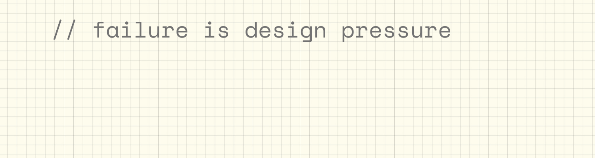

  

 

## Hi There, I'm Naila! 👋

I don’t see code as syntax. I see it as structure. As tradeoffs. As decisions that compound over time.

Good systems are not accidental.
They are composed.

Every abstraction reflects judgment.
Every constraint reveals priorities.

I care about building software that is:
- correct before clever
- readable before impressive
- resilient under real-world pressure

## Core Stack

## Machine Learning Stack

 

If you’re interested in how I think,
the code is the conversation.
